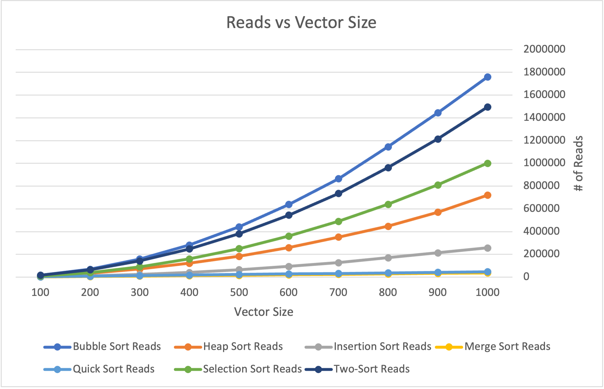
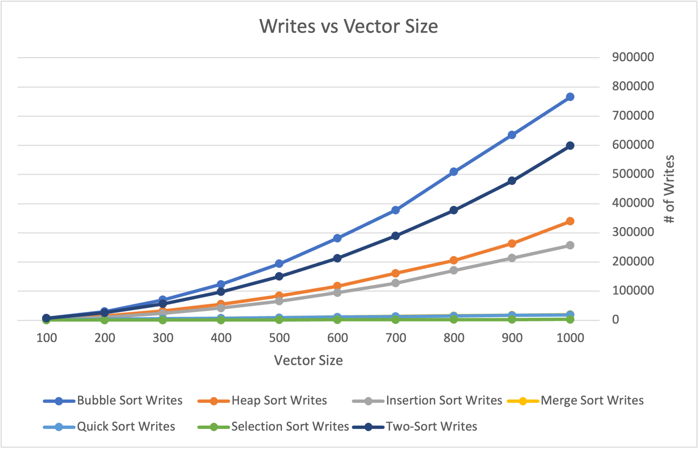
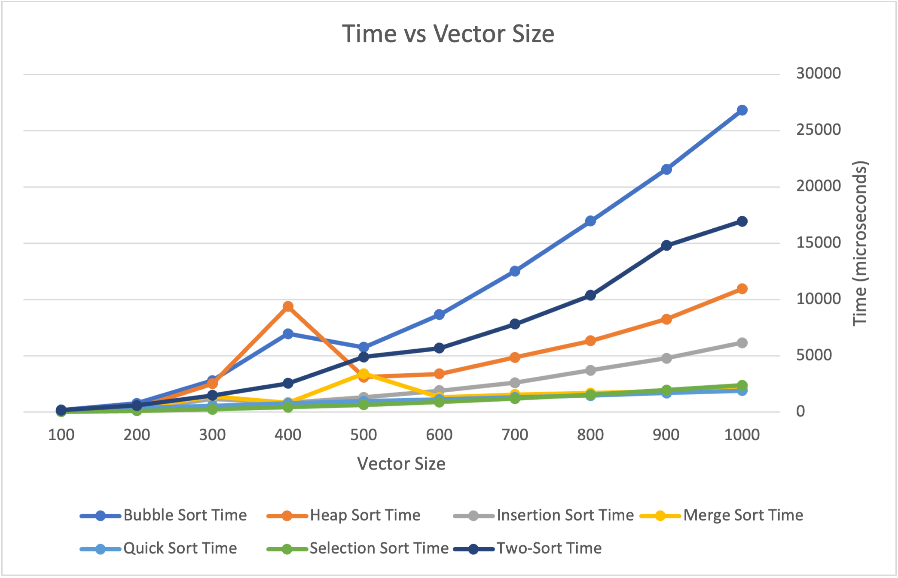

# CS 124 Project 4

For this project, you will sort the 1000 objects from your data set. You will modify each sorting algorithm to collect data. You will analyze the results from the different sorting algorithms.

## Implement
You should have your 1000+ objects stored in a vector, initially unsorted.
Use these five sorting algorithms:
1. Bubble Sort
2. Choose either Selection Sort or Insertion Sort
3. Choose either Merge Sort or Quick Sort
4. Heap Sort
5. Two-sort: sort by any algorithm (except Bubble Sort), then sort on a different field using a stable sorting algorithm (again, except Bubble Sort).
   * Hint for implementing two-sort: for the second stable algorithm, make a copy of the stable sorting function and take out the template part. That way you will be able to call a getter on your custom-type objects to compare a second field of your class.

Modify each sorting algorithm to record the number of reads. This is the number of times you use a Comparable object. This could be using it to store somewhere else, using it to compare to another object, etc. Temporary Comparable objects count towards the reads. 
* Example code:
  ```cpp
  if (vec[i] > vec[i+1]) // This counts as two reads, which should
      // be counted whether the if statements evaluates to true or false.
  Comparable temp = vec[i]; // This is one read.
  smaller.push_back(vec[i]); // This is one read.
  ```
Modify each sorting algorithm to record the number of writes. This is the number of times you assign into a Comparable object. This could be to store a temporary Comparable, to overwrite an item in a Comparable vector, to push_back onto a Comparable vector, etc.
* Example code:
  ```cpp
  Comparable temp = vec[i]; // This is one write (and one read).
  smaller.push_back(vec[i]); // This is one write (and one read).
  vec[i] = vec[i+1]; // This is one write (and one read).
  ```
Use a loop to record the number of reads and writes needed to sort a vector of size 100, 200, 300, 400, 500, 600, 700, 800, 900, and 1000.
* Hint: start with 1000 and then use the resize method to make it smaller. 

Each of the five sorting algorithms should be given identical unsorted vectors to begin with. 
* If your data is naturally sorted by the attribute you use to overload your operators, change how you overload your operators.

## Extra Credit
To earn up to 10 extra credit points (at the grader’s discretion), you can get more thorough results. This can include, but is not limited to:
* Setting timers to record how long it takes you to sort the objects with each algorithm.\
  I completed this section of the extra credit. I felt as if it made the most sense to include the results from this in the `Analyze the data` section of the report, so the results can be found there.
* Performing the same experiment, except double the size of the data set each time (instead of having it grow linearly).
* Using more sorting algorithms.\
  I completed this section of the extra credit. This has also been included in the `Analyze the data` section of the report.

Note that if you add this logic to your code but do not analyze it in your report, it will not count towards extra credit. If you complete extra credit, analyze it in this section of your README.md file.

## Report
Include the following in this section of your README.md file:
* Information about your data set (you will be assigned a different grader for this project).\
  This dataset is titled [Spotify - All Time Top 2000s Mega Dataset](https://www.kaggle.com/datasets/iamsumat/spotify-top-2000s-mega-dataset?resource=download&select=Spotify-2000.csv) and contains information on 1994 unique tracks on spotify that was obtained using Spotify's API. This dataset can be found on the website Kaggle. I chose this data set because I found it very interesting that an algorithm could be used to give songs "scores" in areas such as danceability.
* Analyze the data. Graph the number of reads and writes for each sorting algorithm and look at how the number of reads and writes grows when the size of the data set grows. Compare and contrast the different sorting algorithms and draw conclusions about which sorting algorithms are more efficient. Discuss complexities and their effects.\
  I decided to have these sorting algorithms sort the data based on song duration. The two-sort algorithm I used first sorted the data by song duration and then by song index. The following graphs display the number of reads, the number of writes, and the amount of time for each of the sorting algorithms:
  
  
* 
  * `Bubble Sort`: It is evident from the included graphs that, for these data, bubble sort is the least efficient of the algorithms used. In terms of reads and writes, bubble sort had the greatest number for each when compared to the other sorting algorithms. Bubble sort also took the longest out of any algorithm used, and it has a time complexity of O(n^2). A couple redeeming qualities of bubble sort, however, are that it has a constant auxiliary complexity and it is stable.
* Answers to the following questions: 
  * If you need to sort a contacts list on a mobile app, which sorting algorithm(s) would you use and why? 
  * What about if you need to sort a database of 20 million client files that are stored in a datacenter in the cloud?

**Note: Any code that was not authored by yourself or the instructor must be cited in your report. This includes the use of concepts not taught in lecture.**
https://www.geeksforgeeks.org/measure-execution-time-function-cpp/
https://www.techiedelight.com/copy-vector-cpp/

## Submit
You must include your source (all .cpp and .h) files, your data (.csv) file(s), CMakeLists.txt, and your updated README.md file that contains your report to your repository. Submit to Gradescope using the GitHub repository link, double-check that all the correct files are there, and wait for the autograder to provide feedback.

## Grading
The project is out of 90 points.

| Points Possible | Description of requirement |
|------------------- | ----------------------------- |
| 5 pts | Program compiles and runs. |
| 5 pts | Code style. Readable, naming style is consistent, comments where appropriate. |
| 5 pts | Use five sorting algorithms according to the directions above. |
| 15 pts | Sort the 100, 200, … 1000 objects according to the directions above. |
| 40 pts | Record the correct number of reads and writes for each sort. |
| 20 pts | Report: content, formatting, professional, grammatically correct, cites sources. |